# box2card

Convert [Wikipedia infoboxes](https://en.wikipedia.org/wiki/Help:Infobox) into [Adaptive Cards](https://adaptivecards.io/).

## Overview

### Adaptive Cards

[Adaptive Cards](https://adaptivecards.io/) are platform-agnostic UI elements described in JSON that can be rendered and presented in a wide variety of environments such as websites, mobile apps, digital assistants, and messaging platforms. They represent an opportunity for creating and reusing high-level UI templates compatible with popular ontologies and schemas, such as [Schema.org](https://schema.org/). Unfortunately, very few templates have been created and shared by the community since the project's inception in 2016. 

<figure>
  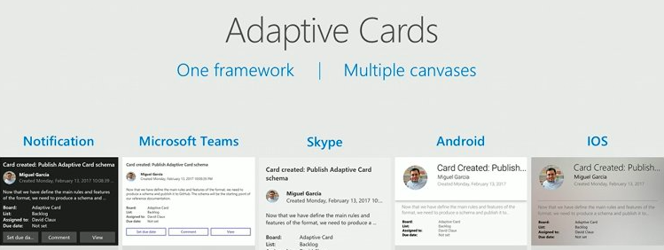
  <figcaption><a href=https://www.npmjs.com/package/adaptivecards-uhub>Source</a></figcaption>
</figure>

### Wikipedia infoboxes

[Wikipedia infoboxes](https://en.wikipedia.org/wiki/Help:Infobox) are tables of data typically presented on the right of Wikipedia articles that describe and summarize their subject. Wikipedia's [list of infobox templates](https://en.wikipedia.org/wiki/Wikipedia:List_of_infoboxes) includes over 1,450 distinct infobox templates, covering a wide range of subjects. These templates were carefully crafted and iterated over for decades by a large community of domain experts to capture the unique presentation characteristics of their domains. This effort is unlikely to be replicated, and it seems unwise not to leverage such an ontological goldmine.

<figure>
  
  <figcaption><a href=https://upload.wikimedia.org/wikipedia/commons/2/2d/Xuanhanosaurus_taxobox%2C_June_2020.png>Source</a></figcaption>
</figure>

### box2card

The **box2card** project is an experiment and a proof-of-concept that attemps to find whether the effort invested by the Wikipedia community into infobox templates can be leveraged to fill the gap in Adaptive Card's community templates.

## Research questions

1. Can [infobox templates](https://en.wikipedia.org/wiki/Template:Infobox) be partially or completely converted into [adaptive card templates](https://docs.microsoft.com/en-us/adaptive-cards/templating/language)?

1. Can [infobox schemas](https://en.wikipedia.org/wiki/Template:Infobox#HTML_classes_and_microformats) be mapped to external ones such as [Schema.org](https://schema.org) without losing formatting information?

1. Can [infobox designs](https://en.wikipedia.org/wiki/Help:Designing_infoboxes) fit into or be adapted for non-encyclopedic use cases such as digital assistants and messaging platforms?

1. Can [infobox categories](https://en.wikipedia.org/wiki/Wikipedia:List_of_infoboxes) naturally be extended to include non-encyclopedic ones such as GitHub issues, restaurant reservations, business cards, product reviews, and social media posts?

## Methods

To answer question 1 (feasibility of infobox template extraction), I implemented a Python script which, given an entity (Wikipedia article):

1. Extracts the data of its infobox (JSON).

1. Converts (best effort) the template of its infobox as an adaptive card template (JSON).

This pair of data and template JSON payloads can then be rendered using the [Adaptive Cards Designer](https://adaptivecards.io/designer/) to analyze the effectiveness of the approach.

## Results

Preliminary results regarding question 1 were obtained by testing the tool against 12 distinct entities belonging to different categories:

1. Amazon (company)

1. Changi Airport (airport)

1. Eiffel Tower (landmark/building)

1. F.C. United of Manchester (sports team)

1. Guitar (musical instrument)

1. Homer Simpson (fictional character)

1. Museum of Modern Art (place)

1. Squid Game (TV series)

1. Steve Jobs (person)

1. Terminator 2 (movie)

1. Tesla Model 3 (car)

1. The Dark Side of the Moon (music album)

The rendered adaptive cards can be seen below:

---

### 1. Amazon

[Wikipedia article](https://wikipedia.org/wiki/Amazon_Inc)

[Open in Adaptive Cards Designer](https://adaptivecards.io/designer?card=https://raw.githubusercontent.com/miguelrochefort/box2card/main/samples/Amazon_Inc.template.json&data=https://raw.githubusercontent.com/miguelrochefort/box2card/main/samples/Amazon_Inc.data.json) (select *Preview mode*)

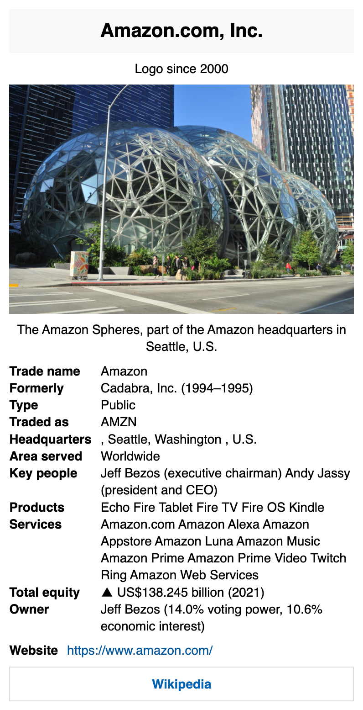

---

### 2. Changi Airport

[Wikipedia article](https://wikipedia.org/wiki/Changi_Airport)

[Open in Adaptive Cards Designer](https://adaptivecards.io/designer?card=https://raw.githubusercontent.com/miguelrochefort/box2card/main/samples/Changi_Airport.template.json&data=https://raw.githubusercontent.com/miguelrochefort/box2card/main/samples/Changi_Airport.data.json) (select *Preview mode*)

---

### 3. Eiffel Tower

[Wikipedia article](https://wikipedia.org/wiki/Eiffel_Tower)

[Open in Adaptive Cards Designer](https://adaptivecards.io/designer?card=https://raw.githubusercontent.com/miguelrochefort/box2card/main/samples/Eiffel_Tower.template.json&data=https://raw.githubusercontent.com/miguelrochefort/box2card/main/samples/Eiffel_Tower.data.json) (select *Preview mode*)

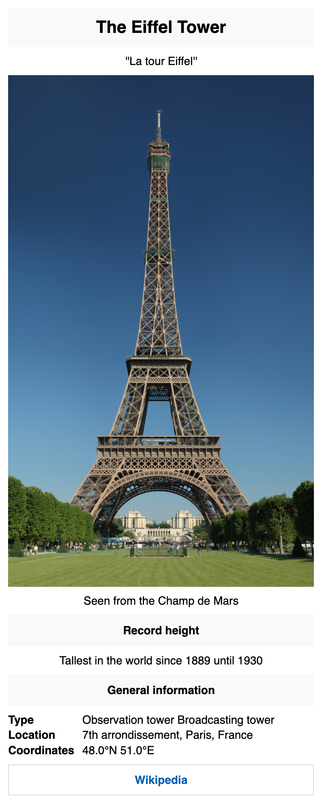

---

### 4. FC United of Manchester

[Wikipedia article](https://wikipedia.org/wiki/F.C._United_of_Manchester)

[Open in Adaptive Cards Designer](https://adaptivecards.io/designer?card=https://raw.githubusercontent.com/miguelrochefort/box2card/main/samples/FC_United_of_Manchester.template.json&data=https://raw.githubusercontent.com/miguelrochefort/box2card/main/samples/FC_United_of_Manchester.data.json) (select *Preview mode*)

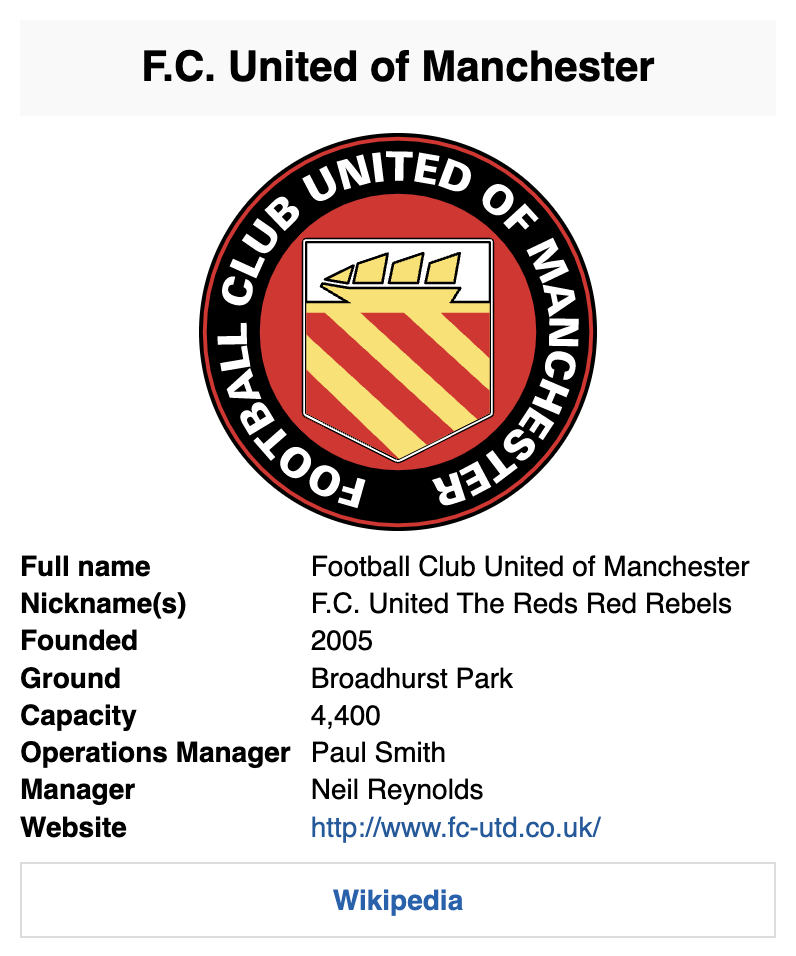

---

### 5. Guitar

[Wikipedia article](https://wikipedia.org/wiki/Guitar)

[Open in Adaptive Cards Designer](https://adaptivecards.io/designer?card=https://raw.githubusercontent.com/miguelrochefort/box2card/main/samples/Guitar.template.json&data=https://raw.githubusercontent.com/miguelrochefort/box2card/main/samples/Guitar.data.json) (select *Preview mode*)

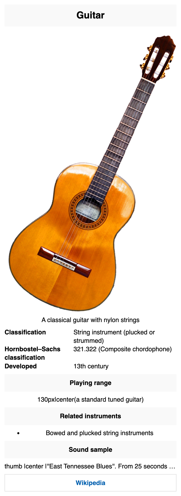

---

### 6. Homer Simpson

[Wikipedia article](https://wikipedia.org/wiki/Homer_Simpson)

[Open in Adaptive Cards Designer](https://adaptivecards.io/designer?card=https://raw.githubusercontent.com/miguelrochefort/box2card/main/samples/Homer_Simpson.template.json&data=https://raw.githubusercontent.com/miguelrochefort/box2card/main/samples/Homer_Simpson.data.json) (select *Preview mode*)

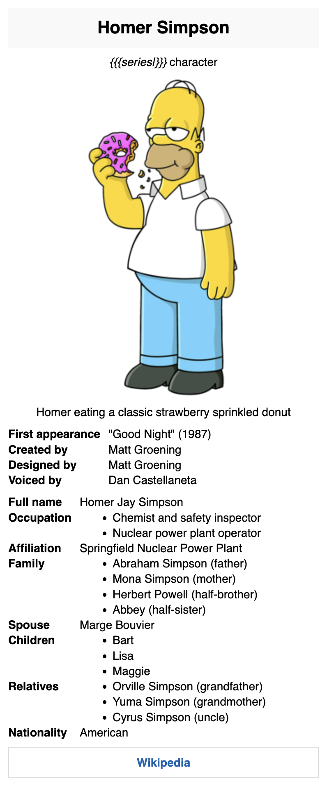

---

### 7. Museum of Modern Art

[Wikipedia article](https://wikipedia.org/wiki/Museum_of_Modern_Art)

[Open in Adaptive Cards Designer](https://adaptivecards.io/designer?card=https://raw.githubusercontent.com/miguelrochefort/box2card/main/samples/Museum_of_Modern_Art.template.json&data=https://raw.githubusercontent.com/miguelrochefort/box2card/main/samples/Museum_of_Modern_Art.data.json) (select *Preview mode*)

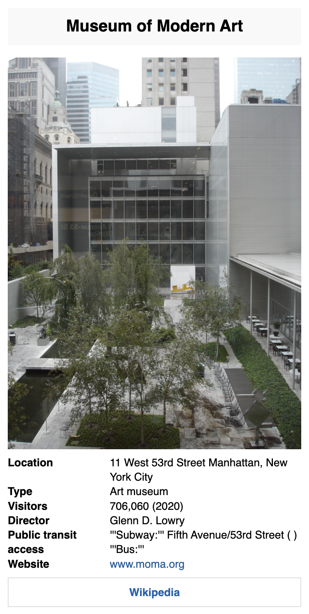

---

### 8. Squid Game

[Wikipedia article](https://wikipedia.org/wiki/Squid_Game)

[Open in Adaptive Cards Designer](https://adaptivecards.io/designer?card=https://raw.githubusercontent.com/miguelrochefort/box2card/main/samples/Squid_Game.template.json&data=https://raw.githubusercontent.com/miguelrochefort/box2card/main/samples/Squid_Game.data.json) (select *Preview mode*)

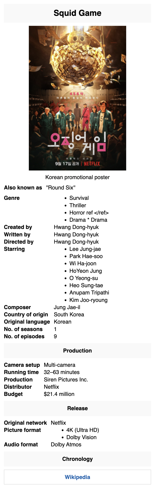

---

### 9. Steve Jobs

[Wikipedia article](https://wikipedia.org/wiki/Steve_Jobs)

[Open in Adaptive Cards Designer](https://adaptivecards.io/designer?card=https://raw.githubusercontent.com/miguelrochefort/box2card/main/samples/Steve_Jobs.template.json&data=https://raw.githubusercontent.com/miguelrochefort/box2card/main/samples/Steve_Jobs.data.json) (select *Preview mode*)

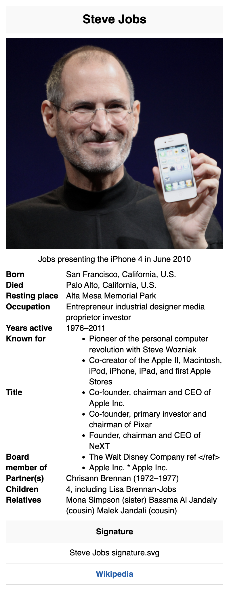

---

### 10. Terminator 2

[Wikipedia article](https://wikipedia.org/wiki/Terminator_2)

[Open in Adaptive Cards Designer](https://adaptivecards.io/designer?card=https://raw.githubusercontent.com/miguelrochefort/box2card/main/samples/Terminator_2.template.json&data=https://raw.githubusercontent.com/miguelrochefort/box2card/main/samples/Terminator_2.data.json) (select *Preview mode*)

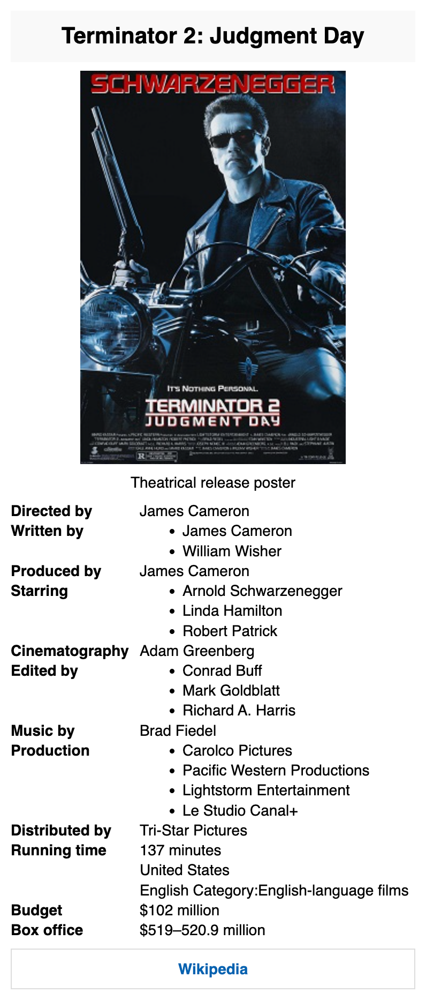

---

### 11. Tesla Model 3

[Wikipedia article](https://wikipedia.org/wiki/Tesla_Model_3)

[Open in Adaptive Cards Designer](https://adaptivecards.io/designer?card=https://raw.githubusercontent.com/miguelrochefort/box2card/main/samples/Tesla_Model_3.template.json&data=https://raw.githubusercontent.com/miguelrochefort/box2card/main/samples/Tesla_Model_3.data.json) (select *Preview mode*)

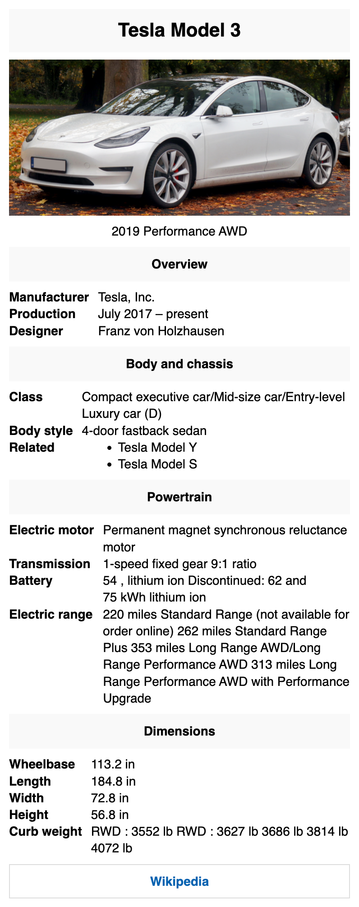

---

### 12. The Dark Side of the Moon

[Wikipedia article](https://wikipedia.org/wiki/The_Dark_Side_of_the_Moon)

[Open in Adaptive Cards Designer](https://adaptivecards.io/designer?card=https://raw.githubusercontent.com/miguelrochefort/box2card/main/samples/The_Dark_Side_of_the_Moon.template.json&data=https://raw.githubusercontent.com/miguelrochefort/box2card/main/samples/The_Dark_Side_of_the_Moon.data.json) (select *Preview mode*)

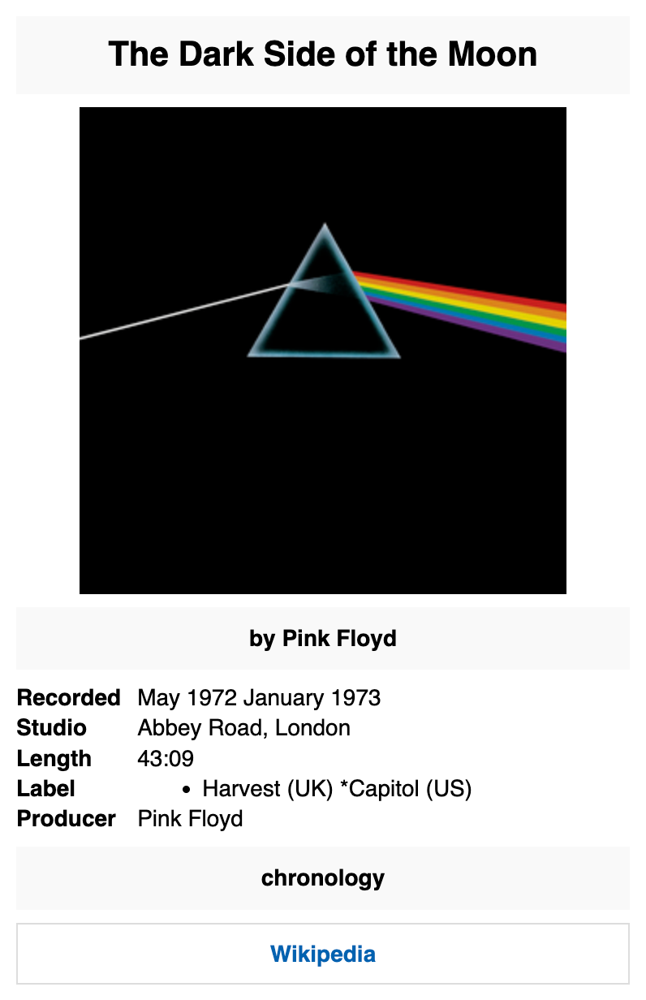

---

## Discussion

While these preliminary results are not perfect (many elements are missing, some wikidata templates are not supported, line breaks are inconsistent, lists are not ideally rendered), they show the potential of the approach and indicate that extracting infobox templates is at least partially feasible.